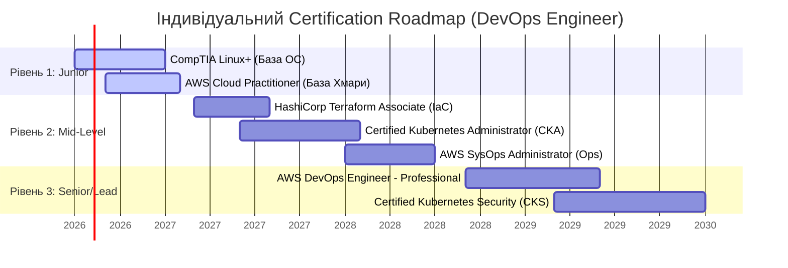

# Лабораторна робота №1

## Тема: Стандартизація та проектування стратегії професійної сертифікації в IT

### Напрямок: DevOps Engineer (Фокус на інфраструктурі та безпеці)

---

## 1. Аналіз нормативної бази (Стандарти)

Для ролі **DevOps Engineer** забезпечення надійності, безпеки та масштабованості інфраструктури є першочерговим завданням. Впровадження підходів автоматизації (Infrastructure as Code, CI/CD, GitOps) вимагає суворого дотримання міжнародних стандартів для мінімізації ризиків. У цій роботі досліджено два ключові стандарти: **ISO/IEC 27001** (у контексті DevSecOps) та **IEEE 802.1Q** (у контексті автоматизації мереж).

### 1.1. Стандарт ISO/IEC 27001 (Контроль безпеки та DevSecOps)

Міжнародний стандарт ISO/IEC 27001 визначає вимоги до системи управління інформаційною безпекою (СУІБ). З оновленням стандарту у 2022 році акцент змістився в бік технічних контролів, які безпосередньо впливають на процеси розробки та розгортання ПЗ за методологією DevSecOps.

* **Вплив на процеси розробки (Annex A Controls):**
  * **Control A.8.25 (Secure Development Life Cycle):** Вимагає інтеграції безпеки на всіх етапах життєвого циклу розробки. Для DevOps це означає концепцію **"Shift Left"** — впровадження автоматизованих перевірок безпеки (лінтинг конфігурацій, аналіз залежностей) на етапі створення коду та перших етапів CI-конвеєра.
  * **Control A.8.28 (Secure Coding):** Встановлює принципи безпечного програмування. У CI/CD пайплайнах це реалізується через обов'язкові кроки **SAST** (Static Application Security Testing) та **SCA** (Software Composition Analysis), які блокують збірку в разі виявлення критичних уразливостей або застарілих бібліотек із відомими CVE.
  * **Control A.8.31 (Separation of Development, Test, and Production Environments):** Вимагає суворої ізоляції середовищ розробки, тестування та продакшену. DevOps-інженер забезпечує це за допомогою інструментів IaC (наприклад, Terraform), створюючи ізольовані VPC, застосовуючи різні аккаунти хмарних провайдерів (наприклад, AWS Organizations) та впроваджуючи механізми динамічного маскування даних (Data Masking) для тестових середовищ.
  * **Control A.8.32 (Change Management):** Традиційні ручні процедури погодження замін замінюються **автоматизованим аудитом**. Кожен крок розгортання фіксується у Git (GitOps-підхід), де історія комітів, результати тестів та схвалення Pull Request (Peer Review) слугують незаперечним доказом комплаєнсу для аудиторів.

### 1.2. Стандарт IEEE 802.1Q (Мережеві стандарти та автоматизація інфраструктури)

IEEE 802.1Q є стандартом для віртуальних локальних мереж (VLAN) на рівні управління доступом до середовища (MAC). Він визначає систему тегування VLAN-кадрів, що дозволяє передавати трафік декількох ізольованих мереж через один фізичний інтерфейс (Trunk port).

* **Вплив на інфраструктурну автоматизацію (Network-as-Code):**
  * **Логічна сегментація інфраструктури:** У сучасних дата-центрах та хмарах DevOps-інженери використовують автоматизацію для створення та керування мережами. Стандарт 802.1Q дозволяє за допомогою коду (Terraform, Ansible) динамічно виділяти ізольовані мережеві сегменти (VLAN IDs) для різних мікросервісів або рівнів архітектури (наприклад, відокремлення трафіку бази даних від публічного веб-трафіку).
  * **Динамічне створення ефемерних середовищ:** Під час виконання CI/CD пайплайнів для запуску інтеграційних тестів автоматично створюється нове середовище. Використання тегування за стандартом 802.1Q дає змогу ізолювати трафік тестового середовища на мережевому рівні, запобігаючи перехресному впливу (cross-talk) між паралельними збірками.
  * **Запобігання загрозам безпеки:** Конфігурація Trunk-портів та native-VLAN за допомогою інструментів автоматизації (Configuration Management) виключає людський фактор, що запобігає таким атакам, як *VLAN Hopping* або *VLAN Leaking*, забезпечуючи суворе виконання політик безпеки на фізичному та віртуальному рівнях комутації.

## 2. Класифікація сертифікаційних програм

Для формування збалансованого профілю DevOps-інженера необхідно поєднувати сертифікації різних типів: від базових до вузькоспеціалізованих архітектурних рішень.

| Тип сертифікації | Назва програми | Провайдер | Призначення та фокус |
| :--- | :--- | :--- | :--- |
| **Vendor-specific** | AWS Certified DevOps Engineer – Professional | Amazon Web Services (AWS) | Підтвердження глибоких знань автоматизації, налаштування CI/CD, моніторингу та управління інфраструктурою виключно в екосистемі AWS. |
| **Vendor-specific** | Red Hat Certified Specialist in Ansible Automation | Red Hat | Перевірка практичних навичок автоматизації конфігурацій, оркестрації систем за допомогою Ansible Enterprise. |
| **Vendor-neutral** | Certified Kubernetes Administrator (CKA) | The Linux Foundation / CNCF | Підтвердження навичок адміністрування, архітектури та управління контейнеризованими додатками у будь-яких кластерах Kubernetes (on-premise чи хмара). |
| **Vendor-neutral** | HashiCorp Certified: Terraform Associate | HashiCorp | Перевірка знань концепцій Infrastructure as Code та практичного використання Terraform незалежно від цільової хмари. |
| **Entry-level** | Microsoft Certified: Azure Fundamentals (AZ-900) | Microsoft | Базове розуміння концепцій хмарних обчислень, мереж, безпеки та управління в Azure. Ідеально для старту. |
| **Entry-level** | CompTIA Linux+ | CompTIA | Фундаментальні знання адміністрування ОС Linux, конфігурації мереж та написання Bash-скриптів. |

---

## 3. Дослідження процедури та кухні іспитів

Для детального аналізу обрано сертифікацію **Certified Kubernetes Administrator (CKA)** від **The Linux Foundation / Cloud Native Computing Foundation (CNCF)**. Це один із найбільш шанованих та практичних іспитів у сфері DevOps.

* **Провайдер тестування:** Іспит проводиться через платформу **PSI** (під контролем The Linux Foundation). Реєстрація та планування здійснюються на порталі Linux Foundation Training.
* **Метод контролю (Прокторинг):**
  * Іспит складається дистанційно (онлайн) з дому або офісу The Linux Foundation.
  * Застосовується **суворий живий прокторинг (Live Proctoring)** через спеціальний захищений браузер (PSI Secure Browser).
  * Перед початком іспиту проктор вимагає показати посвідчення особи (паспорт/ID-картку) на камеру.
  * Проводиться **360-градусний огляд кімнати**: кандидат повинен повільно повернути веб-камеру, щоб показати робочий стіл (він має бути повністю пустим, без паперів, гаджетів, додаткових моніторів), підлогу, стелю та кути кімнати. Двері в кімнату повинні залишатися зачиненими.
  * Під час іспиту заборонено розмовляти, закривати рот руками, залишати зону видимості камери або відводити погляд від монітора на тривалий час. Навіть читання завдань вголос вважається порушенням.
* **Структура іспиту:**
  * **Тип завдань:** Повністю практичний іспит (**Performance-based / Hands-on labs**). Тестових питань (multiple choice) немає. Кандидату надається доступ до терміналу та кількох реальних кластерів Kubernetes у середовищі Ubuntu.
  * **Кількість завдань:** Від 15 до 20 практичних кейсів (наприклад, усунення несправностей у кластері, налаштування мережевих політик, створення резервних копій etcd, конфігурація RBAC, оновлення версії кластера).
  * **Тривалість:** 120 хвилин (2 години).
  * **Дозволені ресурси:** Дозволено відкривати одну додаткову вкладку в межах захищеного браузера для доступу до офіційної документації (kubernetes.io/docs, github.com/kubernetes). Використання пошукових систем (Google) або StackOverflow суворо заборонено.
  * **Прохідний бал:** **66%** від загальної кількості балів. Результати надходять на електронну пошту протягом 24 годин після завершення іспиту.
* **Валідність та умови продовження:**
  * **Термін дії:** Сертифікат CKA є валідним протягом **3 років** з моменту успішної здачі.
  * **Умови продовження (Ресертифікація):** Автоматичного продовження через накопичення балів CPE для CKA не передбачено. Для підтримки статусу необхідно або знову скласти поточну версію іспиту CKA до закінчення терміну дії, або скласти сертифікацію вищого рівня — **Certified Kubernetes Security Specialist (CKS)**, яка демонструє поглиблені знання з безпеки Kubernetes і продовжує термін актуальності експертного статусу фахівця в екосистемі CNCF.

## 4. Побудова індивідуального Certification Roadmap

Проектування кар'єрного шляху на 3-5 років від рівня Junior до Senior/Lead DevOps Engineer передбачає поступове ускладнення сертифікаційних програм з урахуванням концепцій автоматизації та безпеки.

### Рівень 1: Fundamental (Рік 1 — Junior DevOps)

* **Мета:** Закласти фундамент адміністрування систем, базових мережевих концепцій та розуміння хмарних архітектур.
* **Сертифікації:**
    1. **CompTIA Linux+** або **LFCS (Linux Foundation Certified System Administrator)**: підтвердження навичок роботи з ОС Linux, яка є базою для 95% інфраструктури.
    2. **AWS Certified Cloud Practitioner** (або Azure AZ-900): базове розуміння хмарної термінології, моделей розгортання та безпеки в хмарі.

### Рівень 2: Associate / Professional (Роки 2-3 — Mid-Level DevOps)

* **Мета:** Освоєння інструментів автоматизації як коду, побудови CI/CD пайплайнів та оркестрації контейнерів.
* **Сертифікації:**
    1. **HashiCorp Certified: Terraform Associate**: стандарт де-факто для опису інфраструктури (IaC).
    2. **Certified Kubernetes Administrator (CKA)**: ключова сертифікація для підтвердження вміння керувати контейнеризованими мікросервісними архітектурами.
    3. **AWS Certified SysOps Administrator – Associate**: практичне підтвердження навичок розгортання, управління та моніторингу систем у хмарі.

### Рівень 3: Expert / Specialty (Роки 4-5 — Senior / Lead DevOps)

* **Мета:** Архітектурне проектування відмовостійких систем, впровадження комплексних безпекових рішень (DevSecOps), управління великими інфраструктурними командами (Platform Engineering).
* **Сертифікації:**
    1. **AWS Certified DevOps Engineer – Professional**: найвищий рівень автоматизації та управління життєвим циклом додатків у хмарі AWS.
    2. **Certified Kubernetes Security Specialist (CKS)**: експертна сертифікація, орієнтована на безпеку контейнерів, аудит кластерів та захист середовища виконання (відповідно до стандартів безпеки, наближених до ISO 27001).

## 5. Обґрунтування бізнес-цінності сертифікацій

Проходження сертифікації — це не лише підтвердження особистих знань інженера, але й значний актив для ІТ-компанії та її клієнтів.

* **Вплив на партнерський статус компанії:** Хмарні гіганти (AWS, Microsoft, Google) мають багаторівневі партнерські програми (наприклад, AWS Select/Advanced/Premier Partner; Microsoft Gold Partner). Однією з головних вимог для отримання та утримання вищих статусів є наявність у штаті компанії певної кількості сертифікованих інженерів рівня *Professional* та *Specialty*. Вищий статус дає компанії доступ до маркетингових фондів, знижок на інфраструктуру для внутрішніх потреб та пряму підтримку від архітекторів вендора.
* **Важливість для тендерів та роботи з клієнтами з Fortune 500:** Великі міжнародні замовники, особливо у сферах FinTech, HealthCare та державних закупівель, висувають жорсткі вимоги до кваліфікації виконавців. У тендерній документації часто прямо прописується обов'язкова наявність сертифікатів (наприклад: *"Команда впровадження повинна мати мінімум 2-х сертифікованих архітекторів AWS Professional та експертів CKA"*). Це знижує ризики замовника та гарантує, що інфраструктура буде побудована відповідно до вендорських Best Practices.
* **Міжнародне визнання та релокація:** Сертифікації на кшталт CKA чи AWS DevOps Pro є стандартизованими та однаково визнаються як в Україні, так і в США, ЄС чи Азії. Для роботодавця це об'єктивний маркер знань, що скорочує витрати на технічні співбесіди та спрощує процеси релокації спеціалістів або залучення їх до міжнародних крос-функціональних команд.
* **Зниження бізнес-ризиків (MTTR / Downtime):** Сертифіковані DevOps-інженери, які пройшли практичні іспити (як CKA), володіють перевіреними навичками швидкого пошуку та усунення несправностей (Troubleshooting). Це безпосередньо впливає на метрики **MTTR (Mean Time to Repair)** та знижує фінансові збитки компанії від простою (Downtime) критично важливих бізнес-систем.

## 6. Візуалізація (Mermaid Certification Roadmap)

Нижче наведено графічну траєкторію професійного розвитку DevOps-інженера на найближчі 5 років, згенеровану за допомогою діаграми Mermaid.

---

## Контрольні питання (Відповіді)

1. **У чому різниця між де-факто та де-юре стандартами в IT?**
    * **Де-юре (de jure) стандарти** — це офіційні стандарти, розроблені, погоджені та затверджені визнаними міжнародними організаціями з стандартизації (такими як ISO, IEC, IEEE, W3C, ANSI) шляхом формальних процедур та досягнення консенсусу (наприклад, ISO 27001 або стандарт мови C++ від ISO). Вони мають офіційний статус, часто використовуються в законодавстві та державних тендерах.
    * **Де-факто (de facto) стандарти** — це технології, формати чи інструменти, які завоювали домінуюче становище на ринку через масове практичне використання та визнання спільнотою, навіть якщо вони не мають офіційного статусу від жодного комітету (наприклад, формат контейнеризації Docker до появи специфікації OCI, формат обміну даними JSON, або сам Kubernetes, який став стандартом оркестрації де-факто).

2. **Чому сертифікація Vendor-neutral (напр. PMP, CKA) часто цінується вище за конкретний інструментарій?**
    * Сертифікації *Vendor-neutral* фокусуються на фундаментальних концепціях, методологіях, архітектурних патернах та кращих практиках, які залишаються незмінними незалежно від обраного програмного продукту чи хмарного провайдера. Вони демонструють, що інженер розуміє *принципи* роботи технології (наприклад, CKA перевіряє концепції розподілених систем та оркестрації контейнерів взагалі, а PMP — універсальні процеси управління проектами). Фахівець із такою сертифікацією здатний легко адаптуватися та перенести свої знання на будь-який інший інструмент вендора, тоді як *Vendor-specific* сертифікація часто перевіряє знання специфічного інтерфейсу та API конкретного провайдера (наприклад, клікання в консолі AWS).

3. **Як система прокторингу забезпечує академічну доброчесність під час дистанційних іспитів?**
    * Система прокторингу використовує комплекс технологічних та людських факторів:
        * **Ідентифікація:** Обов'язкова верифікація особи за офіційними документами (паспорт) через камеру.
        * **Контроль оточення:** Повне 360-градусне сканування кімнати для виключення наявності сторонніх осіб, конспектів чи додаткових екранів.
        * **Блокування ПК:** Використання спеціальних захищених браузерів (Secure Browsers), які блокують можливість копіювання, створення скріншотів, перемикання вікон або запуск сторонніх додатків на комп'ютері кандидата.
        * **Постійний моніторинг:** Безперервний запис веб-камери, мікрофона та екрану. Живий проктор (або AI-алгоритми) відстежує рухи очей (щоб кандидат не дивився на шпаргалки поза екраном), сторонні шуми, голоси або появу інших людей у кадрі, фіксуючи будь-яку підозрілу активність для негайного анулювання іспиту.

4. **Що таке CPE (Continuing Professional Education) бали і чому сертифікати мають термін дії?**
    * **CPE (Continuing Professional Education)** — це бали безперервної професійної освіти, які сертифікований фахівець накопичує після здачі іспиту для підтвердження своєї активності у професійній сфері. Бали нараховуються за відвідування профільних конференцій, проходження нових курсів, написання технічних статей, виступи на мітапах або менторство.
    * **Термін дії сертифікатів** (зазвичай 2-3 роки) обумовлений надзвичайно стрімким розвитком ІТ-індустрії. Інструменти, архітектурні підходи та загрози безпеці оновлюються щороку. Обмеження терміну дії гарантує роботодавцям, що володар сертифіката підтримує свої знання в актуальному стані, постійно розвивається і знайомий із останніми змінами в технологічному стеку, а не просто здав іспит 10 років тому за технологіями, які вже застаріли.

5. **Як стандарт SWEBOK допомагає синхронізувати очікування між університетською освітою та індустрією?**
    * **SWEBOK (Software Engineering Body of Knowledge)** — це документ, створений IEEE, який структурує та описує загальноприйняті, перевірені часом області знань (Knowledge Areas), що складають основу інженерії програмного забезпечення.
    * Він виступає як **спільна мова та міст** між двома світами:
        * **Для університетів:** SWEBOK надає чіткий академічний орієнтир та структуру для створення навчальних планів. Замість вивчення лише короткочасних хайпових інструментів, університети будують фундаментальні курси навколо стабільних областей знань (управління вимогами, дизайн ПЗ, конфігураційне управління, якість, тестування).
        * **Для індустрії:** SWEBOK дає роботодавцям чітке розуміння того, якими базовими компетенціями та теоретичною базою володіє випускник інженерної спеціальності, що спрощує оцінку кандидатів під час найму та адаптації (onboarding) на позиції Junior-інженерів.
